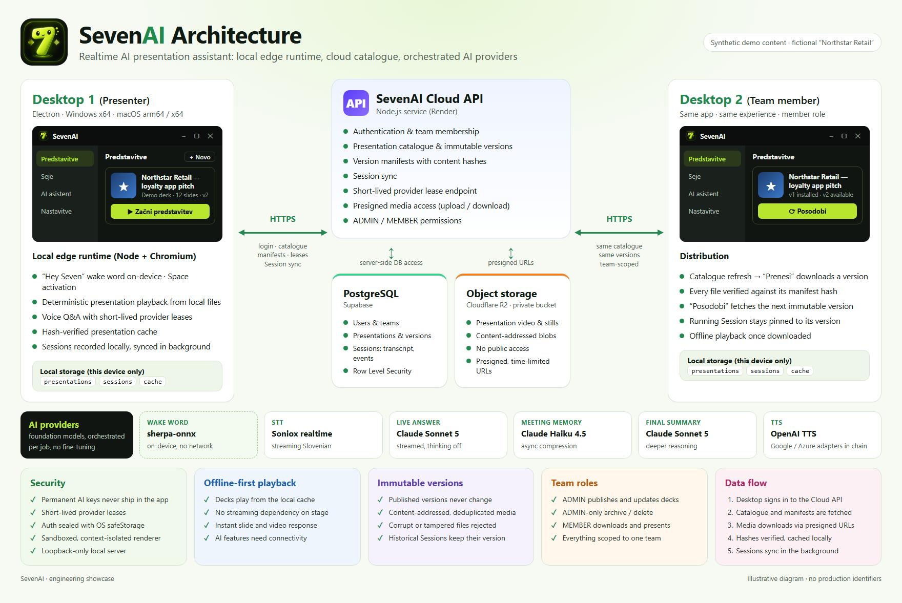
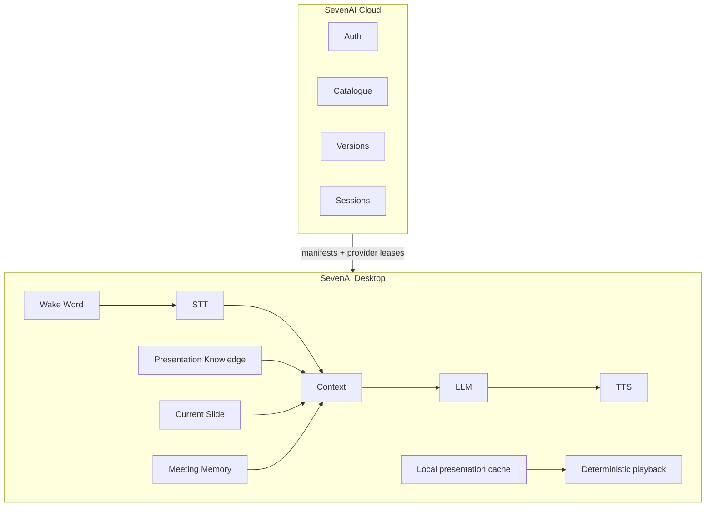
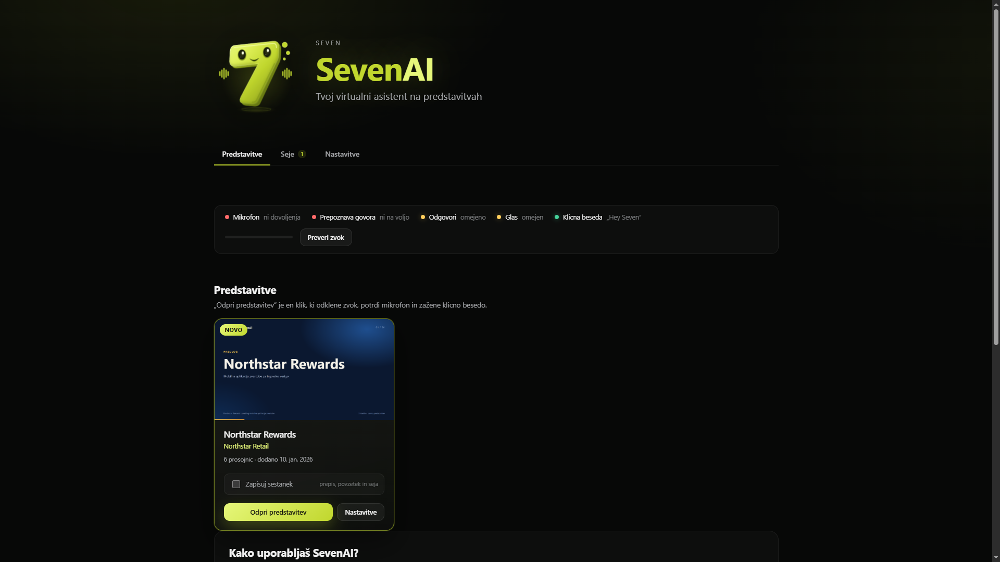
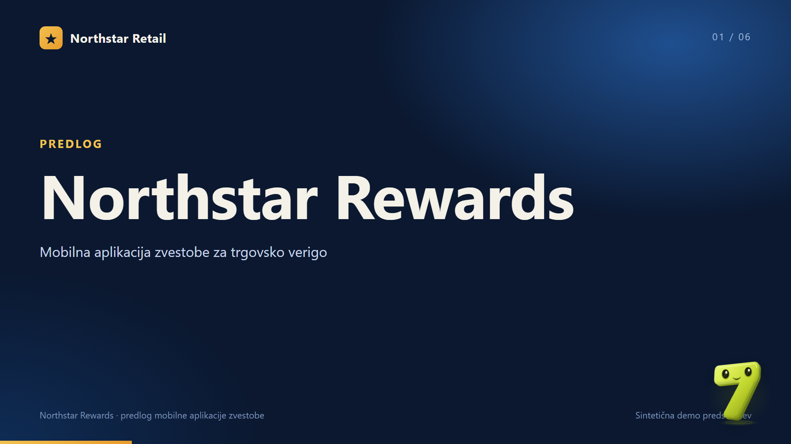
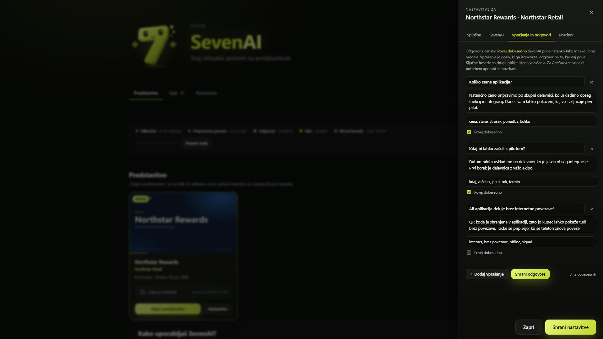
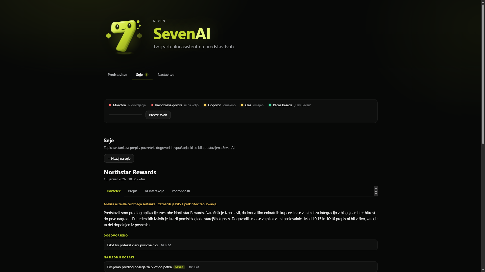
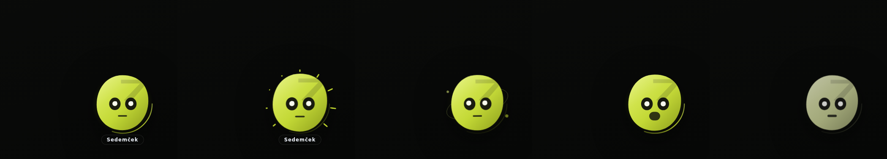

# SevenAI

SevenAI is a realtime AI presentation assistant that listens, answers, navigates slides, remembers meetings and turns every presentation into an interactive conversation.



*Architecture poster. Synthetic illustration, no production data.*

## Architecture at a glance



The same overview as plain text:

```text
┌──────────────────────────────────────────────────────────────┐
│                        SevenAI Cloud                         │
│                                                              │
│         Auth  ·  Catalogue  ·  Versions  ·  Sessions         │
└──────────────────────────────┬───────────────────────────────┘
                               │
                               │  manifests + provider leases
                               ▼
┌──────────────────────────────┴───────────────────────────────┐
│                       SevenAI Desktop                        │
│                                                              │
│  Wake Word ──▶ STT ──▶ Context ──▶ LLM ──▶ TTS               │
│                           ▲                                  │
│   Presentation Knowledge ─┤                                  │
│   Current Slide ──────────┤                                  │
│   Meeting Memory ─────────┘                                  │
│                                                              │
│  Local presentation cache ──▶ deterministic playback         │
└──────────────────────────────────────────────────────────────┘
```

The desktop app plays the deck and runs the voice loop locally. The cloud handles identity, the team's presentation catalogue, immutable presentation versions and synced meeting records. It never proxies a live question. The full breakdown, including object storage, AI providers and Session sync, is in [docs/architecture.md](docs/architecture.md).

## Overview

A presenter opens a client presentation in SevenAI. The deck plays fullscreen with an animated assistant in the corner. When the presenter says **"Hey Seven"** or presses **Space**, SevenAI listens to a spoken Slovenian question. It answers aloud using the slide on screen, the knowledge written for that presentation and what has been said in the meeting so far. It can also move the deck on a voice command ("pojdi na naslednji slajd"). If recording is switched on, the meeting becomes a Session with a transcript, a running structured memory and a final summary.

SevenAI is not a chatbot floating over PowerPoint. The deck, the assistant and the meeting record are one system. The assistant knows which slide is visible, and slide changes are recorded against the transcript. Navigation is deterministic, so a language model never decides which slide to show.

SevenAI is built and used by Sedem d.o.o., a Slovenian agency. **This repository is an engineering showcase, not a distribution channel.** The production source is private. The desktop client goes only to the company's authenticated team, and nothing here links to installers or build artifacts.

## Key capabilities

**VOICE**
- Local wake word "Hey Seven" (sherpa-onnx keyword spotter, no audio leaves the laptop). Space is always an equal alternative.
- One listening session per question: realtime Slovenian speech-to-text, with a local recording running in parallel as a fallback.
- Adaptive end-of-question detection: a shorter silence window when the sentence looks finished, a longer one when it ends on a conjunction or preposition.
- Streamed answers split into sentences. Each sentence is synthesised while the model is still writing the next one.
- Barge-in: activating while SevenAI is thinking or speaking cancels the current answer and starts a new question.
- One-voice invariant: a single playback slot, so two speech outputs can never overlap.

**PRESENTATION**
- A continuous video export (for example a Canva deck exported as one MP4) is turned into a deterministic slide timeline: entrance, hold frame and exit per slide.
- Next, previous, jump to any slide, first and last, fullscreen, keyboard and voice navigation.
- Per-presentation settings: assistant size, subtitles, speaking speed, greeting.
- Scripted Q&A: presenter-written answers matched strictly and spoken word for word before any model is asked.

**KNOWLEDGE**
- A global company/persona layer plus a per-presentation layer, assembled into one prompt-cached system block.
- The current slide's title, summary and key points travel with every question, so words like "this" or "that solution" resolve against the screen.
- Per-deck terminology feeds both speech recognition and the prompt.

**MEETINGS**
- Recording is opt-in per presentation open and always visibly indicated.
- Append-only, crash-tolerant Session storage: transcript, events, assistant interactions, rolling memory, final summary.
- Background meeting memory: decisions, commitments, open questions, client interests, objections and facts, bounded in size and never on the answer path.
- An assistant-echo filter keeps SevenAI's own voice out of the client transcript without discarding people who talk over it.
- Final meeting summary that structurally separates facts (with timestamps) from AI follow-up suggestions.

**DESKTOP**
- Electron app for Windows x64, macOS Apple Silicon and macOS Intel.
- Team presentations are downloaded once, hash-verified and played offline from a local cache.
- Presentation updates are data, not app updates: a running Session stays pinned to its version.

**ADMIN**
- Immutable, content-addressed presentation versions published through an admin-only pipeline.
- Admin-only deletion. A presentation referenced by past Sessions is archived, not destroyed.
- Member and admin roles, with every cloud query scoped to the caller's team.

**SECURITY**
- No permanent provider keys in the desktop app. Provider access is leased at runtime to an authenticated user and held only in memory.
- OS-sealed credential storage (Electron safeStorage), sandboxed and context-isolated renderer, loopback-only local server, Electron fuses.
- Every desktop build is scanned for secrets and user data in CI before upload.

## Tech stack

| Layer | Technology |
|---|---|
| Desktop shell | Electron (utility-process server, sandboxed renderer) |
| Local runtime | Node.js 22, Express 5, plain JavaScript ES modules |
| Frontend | Vanilla JavaScript ES modules, no framework or bundler |
| Cloud API | Node.js + Express, hosted on Render |
| Database and auth | PostgreSQL on Supabase (Supabase Auth, row-level security) |
| Object storage | Cloudflare R2 (private bucket, presigned URLs) |
| Speech-to-text | Soniox realtime (streaming, speaker diarization); OpenAI transcription as fallback |
| Language models | Anthropic Claude (primary); OpenAI as fallback |
| Text-to-speech | OpenAI `gpt-4o-mini-tts` (streamed PCM); optional additional providers in the chain |
| Wake word | sherpa-onnx keyword spotting, running locally in the desktop process |
| CI | GitHub Actions (desktop installers, scheduled database backups) |

## Realtime AI pipeline

1. **Activation.** The local wake word or Space triggers the same activation function.
2. **Listening.** A realtime STT session opens only for this question. Local voice-activity detection and the provider's endpoint signal decide when the question has ended.
3. **Routing.** A deterministic parser checks whether the sentence is a navigation command. If it is, the deck moves and no model is called.
4. **Scripted answers.** A strict matcher checks the presenter's scripted Q&A. A match is spoken verbatim.
5. **Context assembly.** The cached system block (rules, global and presentation knowledge, terminology, slide index) is combined with the current slide, the meeting memory and the last few minutes of conversation.
6. **Generation.** Claude streams the answer. If the primary provider fails before the first token, the fallback provider takes over. If no token arrives within a timeout, a prepared answer is used.
7. **Speech.** Complete sentences are sent to TTS as soon as they exist, fetched concurrently and played in order through one playback slot.

Details: [docs/realtime-voice.md](docs/realtime-voice.md).

## Model orchestration

SevenAI does not train or fine-tune models. It orchestrates foundation models: each job gets the model that fits its latency and cost profile, and deterministic code handles the jobs where a model guess would be unacceptable.

| Job | Default | Why this model for this job |
|---|---|---|
| Live spoken answer | Anthropic `claude-sonnet-5`, thinking disabled, streamed | Chosen on measured time to the first complete spoken sentence and on holding the spoken word budget. Thinking is explicitly disabled because the live path has a latency budget measured in seconds. |
| Rolling meeting memory | Anthropic `claude-haiku-4-5` | Runs roughly every few minutes in the background during a recorded meeting. It is the most frequent model call, so a small, fast model keeps the cost of a long meeting low while reproducing the structured record reliably. |
| Final meeting summary | Anthropic `claude-sonnet-5`, adaptive thinking, medium effort | Runs after the meeting with no one waiting. Reasoning is worth its latency here, and effort is capped because the task is filling a fixed schema from one transcript. |
| "Ask this Session" after a meeting | Anthropic `claude-sonnet-5`, no extended thinking, short answer | Questions about a finished meeting are answered from its stored record with a small token budget, so a follow-up question stays quick. |
| LLM fallback | OpenAI `gpt-4o-mini` | Takes over if Anthropic fails before the first token, using the same composed prompt. |
| Streaming speech-to-text | Soniox realtime | Low-latency Slovenian streaming with endpoint detection; speaker diarization for meeting recording. The browser connects with a short-lived temporary key. |
| Batch transcription | OpenAI transcription (`gpt-4o-transcribe` by default) | Fallback when the stream is unavailable, and gap-filling from stored audio after a connection drop. Biased with deck terminology. |
| Text-to-speech | OpenAI `gpt-4o-mini-tts` in the current configuration; Google and Azure adapters sit in the same chain | Streamed raw PCM so playback starts before a sentence is fully synthesised. One provider and voice are pinned per answer. |
| Wake word | sherpa-onnx keyword spotter | Runs locally with no account or network, so the idle presentation streams nothing to any provider. |

Each model role has its own configuration override. A cloud lease may move only the live model, so a remote change can never silently move the background roles onto a more expensive model.

Deliberately **not** models: voice navigation parsing, scripted-answer matching, the assistant-echo filter, meeting-question detection and transcript retrieval (a keyword scan, not a vector store). Each is a small, testable, deterministic function.

## Meeting memory

When recording is on, every meeting is a Session folder written continuously to disk. Transcript segments arrive every few seconds. A background job updates a bounded structured memory (`decisions`, `commitments`, `openQuestions`, `clientInterests`, `objections`, `importantFacts`) using only the memory so far plus the new transcript. The tenth update therefore costs the same as the first. Live answers read the latest memory and never wait for an update. When the meeting ends, a fixed chain runs: flush the memory, fill transcript gaps from stored audio, generate the summary, verify the transcript, and only then delete raw audio.

Details: [docs/meeting-memory.md](docs/meeting-memory.md). Synthetic example: [examples/session/](examples/session/).

## Knowledge system

Knowledge is files, not code. A presentation is a folder with metadata, slide descriptions, numbered knowledge documents, terminology, scripted Q&A and an optional greeting. Adding a presentation changes no application code. A shared company/persona layer is the only content common to all decks. Each presentation's prompt is built from that shared layer plus its own folder, which is what keeps one client's material out of another client's meeting.

Details: [docs/knowledge-system.md](docs/knowledge-system.md). Synthetic examples: [demo/sample-presentation/](demo/sample-presentation/) and [examples/knowledge/](examples/knowledge/).

## Desktop and cloud

The desktop app hosts the same local runtime that runs in a browser during development: an Express server bound to loopback, plus the web frontend in a hardened Electron window. The cloud API issues provider leases, serves the team catalogue and version manifests, mints presigned download URLs for private object storage, and receives Session sync. Presentations are published as immutable versions. Members download them once, and a running meeting is never changed underneath the presenter.

Details: [docs/desktop.md](docs/desktop.md), [docs/presentation-versioning.md](docs/presentation-versioning.md).

## Screenshots

All screenshots are **synthetic demo content** built around the fictional company "Northstar Retail". They contain no client material or production data.

| | |
|---|---|
|  <br> **Presentation catalogue:** team decks with preview and meeting-recording toggle |  <br> **Presentation mode:** fullscreen deck with the assistant in the corner |
|  <br> **Presentation settings:** greeting and scripted Q&A |  <br> **Sessions:** meeting record and structured summary |
|  <br> **Assistant states:** the character reflects idle, listening, thinking and speaking | |

## Security

- Provider credentials are never shipped in an installer. After login, the cloud issues a time-bounded lease that lives only in the local server's memory. The browser-side speech connection uses a short-lived temporary key.
- The persisted login is encrypted at rest with a key sealed by the operating system (DPAPI on Windows, Keychain on macOS) through Electron safeStorage.
- The renderer is sandboxed and context-isolated, with no Node integration and a read-only preload. Navigation and new windows are restricted to the app's own origin, and permissions are limited to audio capture, fullscreen and clipboard write.
- The local server binds to loopback only. Packaged builds refuse debugging switches outside an explicit test-harness mode, and Electron fuses disable run-as-Node, `NODE_OPTIONS` and inspector arguments.
- Cloud authorization is team-scoped in one middleware. Row-level security is enabled with default-deny as an independent backstop.
- Destructive operations (presentation deletion) are admin-only. Diagnostics are hidden unless explicitly enabled.

Details: [docs/security.md](docs/security.md). To report a concern, see [SECURITY.md](SECURITY.md).

## Platform support

| Platform | Package | Built by |
|---|---|---|
| Windows x64 | NSIS installer (per-user) | GitHub Actions |
| macOS Apple Silicon (arm64) | DMG | GitHub Actions |
| macOS Intel (x64) | DMG | GitHub Actions |

The development runtime also runs with `node server.js` in a Chromium-based browser on `localhost`.

## Project status

- The desktop app is at **v1.0.x** and is used internally by the Sedem d.o.o. team for live client presentations.
- The cloud API, team catalogue, versioned presentation distribution and Session sync are in production use.
- Automated tests run on Node's built-in test runner. Desktop-specific tests run in CI as part of the installer build jobs.
- There is no auto-updater yet: desktop updates are new internal builds. Presentation content updates through the cloud without reinstalling.

## Repository layout

```text
docs/                 architecture and subsystem documentation
demo/                 synthetic sample presentation (fictional "Northstar Retail")
examples/knowledge/   synthetic global knowledge layer
examples/session/     synthetic Session folder in the real on-disk format
src/                  curated excerpt of production modules (not the full source)
assets/               reviewed synthetic diagrams and screenshots
```

`src/` is an excerpt chosen to illustrate the architecture. It is not a buildable copy of the application.

## Documentation

| Document | Covers |
|---|---|
| [docs/architecture.md](docs/architecture.md) | Layers, desktop vs cloud vs storage vs providers, fallbacks, one-voice playback |
| [docs/realtime-voice.md](docs/realtime-voice.md) | Wake word, STT, endpointing, barge-in, streaming answers, echo control |
| [docs/presentation-engine.md](docs/presentation-engine.md) | Video timeline, navigation, settings, greeting, scripted Q&A |
| [docs/knowledge-system.md](docs/knowledge-system.md) | Knowledge layers, prompt assembly order, isolation, prompt caching |
| [docs/meeting-memory.md](docs/meeting-memory.md) | Session storage, rolling memory, final summary chain |
| [docs/presentation-versioning.md](docs/presentation-versioning.md) | Publish, download, update, pinning, deletion |
| [docs/security.md](docs/security.md) | Credential model, Electron hardening, roles, team scoping |
| [docs/desktop.md](docs/desktop.md) | Platforms, sign-in, offline playback, cleanup, CI builds |

## License

Copyright (c) 2026 Sedem d.o.o. All rights reserved. The source is available for portfolio and demonstration purposes only; see [LICENSE](LICENSE).
