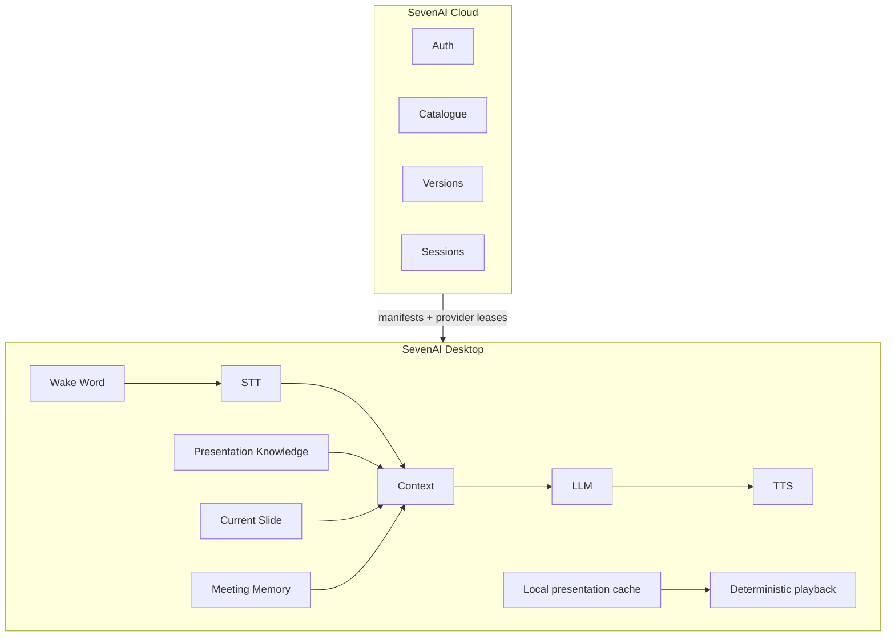
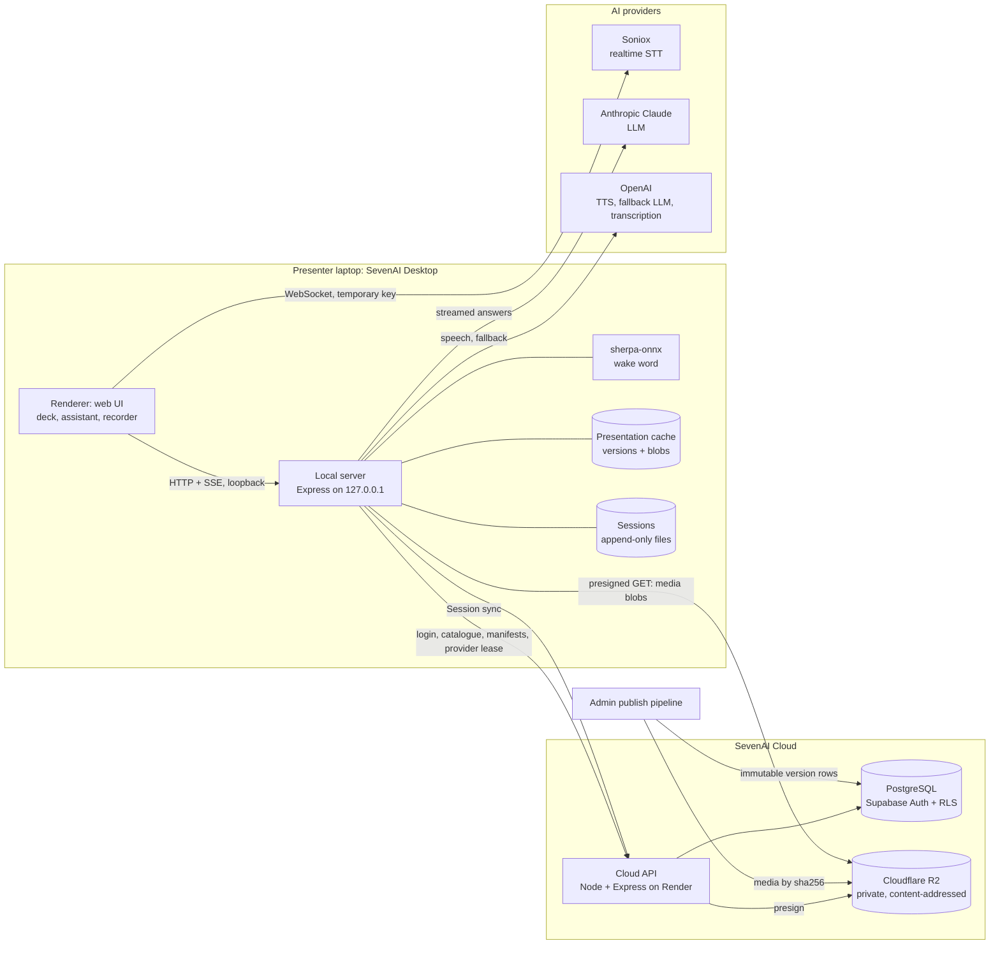

# Architecture

SevenAI has four parts:

1. an **edge runtime** on the presenter's laptop, which plays the deck and runs the voice loop,
2. a **cloud API**, which owns identity, the catalogue, versions and synced meeting records,
3. **private object storage**, which holds presentation media,
4. external **AI providers**, used directly by the edge.

Related: [realtime-voice.md](realtime-voice.md) · [presentation-versioning.md](presentation-versioning.md) · [security.md](security.md) · [desktop.md](desktop.md)

## Layered overview



```text
┌──────────────────────────────────────────────────────────────┐
│                        SevenAI Cloud                         │
│                                                              │
│         Auth  ·  Catalogue  ·  Versions  ·  Sessions         │
└──────────────────────────────┬───────────────────────────────┘
                               │
                               │  manifests + provider leases
                               ▼
┌──────────────────────────────┴───────────────────────────────┐
│                       SevenAI Desktop                        │
│                                                              │
│  Wake Word ──▶ STT ──▶ Context ──▶ LLM ──▶ TTS               │
│                           ▲                                  │
│   Presentation Knowledge ─┤                                  │
│   Current Slide ──────────┤                                  │
│   Meeting Memory ─────────┘                                  │
│                                                              │
│  Local presentation cache ──▶ deterministic playback         │
└──────────────────────────────────────────────────────────────┘
```

## Detailed view



Every edge in this diagram corresponds to code in the production runtime:

| Edge | Purpose | Notes |
|---|---|---|
| Local server → Cloud API | login and token refresh, team catalogue, version records, presigned manifests, provider lease | The UI talks only to the local server. The cloud is a background dependency behind it. |
| Local server → Cloud API (Session sync) | transcript, events and interactions appended in batches; memory and summary uploaded | Cursor-based and idempotent. Raw audio is uploaded only when a Session's retention is set to keep it. |
| Local server → R2 | download of presentation media | Short-lived presigned URLs, minted per request after authorization. The bucket is never public. |
| Renderer → Soniox | streaming speech-to-text | Direct WebSocket using a temporary key. The permanent key never reaches the browser. |
| Local server → Claude / OpenAI | answer generation, TTS, fallback transcription | Direct from the laptop using leased credentials. There is no cloud proxy on the live path. |
| Admin pipeline → Postgres + R2 | publishing a new immutable version | Needs database and storage write credentials that never exist on member laptops. |

## Why playback is local

A client meeting is the worst place to depend on a network round trip.

- **Reliability.** A deck downloaded and verified before the meeting plays even if the venue Wi-Fi fails. The cloud can be asleep, slow or unreachable and the presentation still runs.
- **No streaming dependency.** Media is not streamed from a CDN during the meeting, so there is no buffering in the middle of a slide.
- **Fast slide and video response.** A continuous deck video is loaded fully into memory. Every seek to a slide's cue point is served locally, so "next slide" starts the transition on the keypress.
- **Offline deck playback.** Slides, navigation, fullscreen and the assistant animation need no network at all.
- **AI still needs a network.** Speech recognition, answer generation and speech synthesis call external providers. When they are unreachable the runtime degrades (see [Provider fallbacks](#provider-fallbacks)) instead of taking the presentation down.

The live answer path never calls the SevenAI cloud. The cloud lends provider credentials; it does not proxy requests. A cold-starting cloud instance can therefore delay a login or a sync, but it can never stall a question asked in front of a client.

## Local runtime layers

```text
Electron main process
 ├─ userData root, OS-sealed auth key, logs, single-instance lock
 ├─ permission policy (audio only, own origin)
 ├─ BrowserWindow → http://127.0.0.1:<port>/   (sandboxed, context-isolated)
 └─ utilityProcess → local server (the same server.js used in development)
```

| Layer | Responsibility |
|---|---|
| Shell | Slide index, fullscreen, keyboard navigation, topic search for voice navigation |
| Timeline deck | Drives one continuous video as discrete slides (see [presentation-engine.md](presentation-engine.md)) |
| Assistant overlay | Inline SVG character, state animations, subtitles |
| Activation | Wake word and Space both call one `activate()` function |
| Listening session | Per-question realtime STT with a local recording fallback and voice-activity detection |
| Meeting recorder | Optional continuous transcription and chunked audio, independent of the question path |
| Voice client | SSE answer stream, single-slot TTS playback |
| Local server | Presentation registry, knowledge assembly, answer pipeline, Session store, cloud sync, provider lease, version cache |

Three consumers share the microphone: the wake word, the per-question STT session and the meeting recorder. They share a media stream and nothing else. Turning meeting recording off cannot change how questions are answered, and a failed meeting transcription socket cannot break a question.

## Provider fallbacks

The rule is graceful degradation: every provider sits behind a timeout and a fallback, and no failure is shown to the audience as an error screen.

| Failure | Behaviour |
|---|---|
| Anthropic fails before the first token | OpenAI takes over with the same prompt. Once a token has been emitted, the answer is committed to that provider. |
| No first token within the timeout | The stream is aborted and the best prepared answer for the presentation is spoken. |
| No LLM configured | Every question is answered from the presentation's prepared answers. This is a supported mode. |
| Realtime STT unavailable, unfunded or slow to connect | The local recording made in parallel is transcribed in one shot. A permanent failure is classified once and not retried in a loop. |
| A TTS provider fails | The next configured provider is tried, each with its own timeout. |
| Microphone denied | The deck still opens and navigates. |
| Wake word model unavailable | Logged as informational. Space activation is unaffected. |
| Meeting transcription socket drops | Audio keeps recording, the gap is recorded explicitly, and the post-meeting pass fills it from stored audio. |
| Cloud unreachable | A verified cached presentation starts anyway. A held lease keeps working; renewal is retried. |
| Background memory update fails | The previous memory stays and the next trigger retries with a larger slice. |

## One-voice playback

Exactly one module is allowed to produce speech, and it owns a single playback slot. Taking the slot synchronously silences whoever held it, so overlapping voices are impossible by construction, not just unlikely. This is covered by a dedicated test.

- Every question is an interaction with an id. Sentences carry the id they were produced for, so late audio from an interrupted answer is dropped instead of being spoken over the new one.
- The first successful sentence pins the provider and voice for the rest of the answer, so one answer is always one voice.
- In production the browser's built-in speech synthesis is not used as a fallback voice, because a different voice would read as a different assistant. If synthesis fails, the answer stays visible as subtitles.

## Diagnostics

Presentation mode shows no diagnostics. Latency timings, provider and fallback state, and VAD calibration are available only when the app is opened with `?dev=1`. Even then the HUD starts hidden and is toggled with a key. Per-answer timings are also stored with each Session interaction, so a slow answer can be diagnosed after the meeting without having been visible during it.

## What lives where

| Concern | Location | Never contains |
|---|---|---|
| A presentation's content | its own folder or cached version directory | another presentation's material |
| Reusable company knowledge and persona | global knowledge layer | a client's name |
| What happened in a meeting | Session folder, beside (not inside) presentations | anything a deck needs |
| Application logic | server and frontend modules | client-specific content (enforced by a test) |
| Secrets | cloud environment; leased values in edge memory | the repository, installers, logs |
