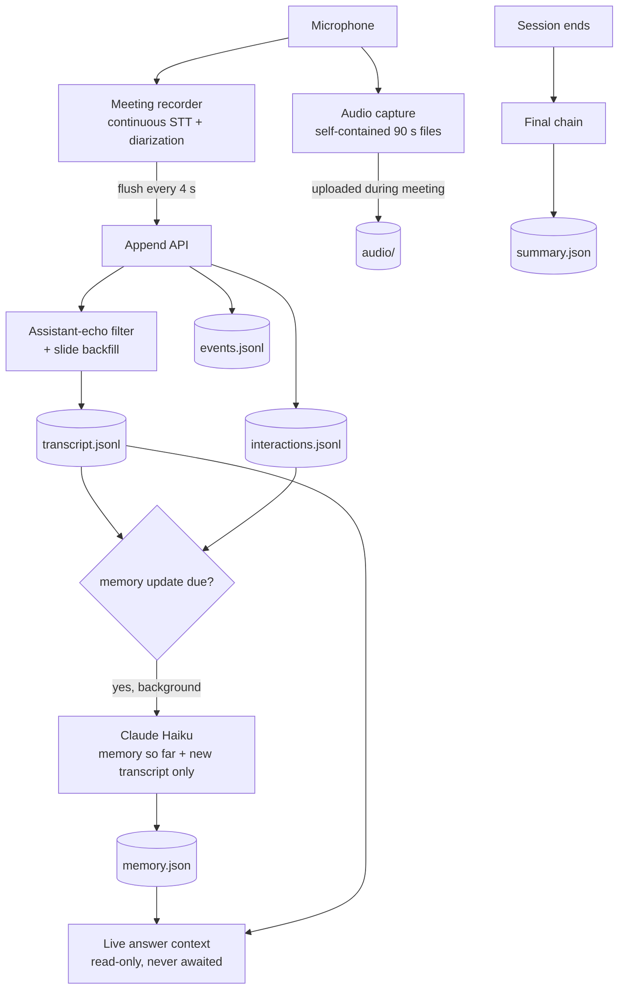

# Meeting memory and Sessions

A **Session** is one meeting. It exists only when the presenter opens a presentation with recording switched on. The Session is written to disk continuously during the meeting and turned into a searchable, summarised record afterwards.

Related: [realtime-voice.md](realtime-voice.md) · [knowledge-system.md](knowledge-system.md) · synthetic example: [examples/session/](../examples/session/)

## Recording is a decision, never a default

The presentation card has a **"Zapisuj sestanek"** ("Record meeting") checkbox. The preference is remembered per laptop. With recording off, no Session is created: the assistant still answers, but nothing is transcribed or stored. While a Session exists, an on-screen indicator is shown, including in fullscreen, and there is no hidden recording mode. Recording can be paused and resumed mid-meeting, and each pause is logged as a gap.

## Architecture



## What a Session stores

```text
sessions/<session-id>/
  session.json                metadata, lifecycle status, stats          rewritten atomically
  transcript.jsonl            one transcript segment per line            append-only
  transcript.realtime.jsonl   live transcript kept when the final pass merges in gap fills
  events.jsonl                one lifecycle / navigation event per line  append-only
  interactions.jsonl          one assistant exchange per line            append-only
  memory.json                 rolling meeting memory                     rewritten atomically
  summary.json                final meeting summary                      written once
  audio/000001.webm …         raw audio chunks + index.jsonl             deleted after processing by default
  sync.json                   cloud sync cursors                         when cloud sync is enabled
```

Session ids look like `s-20260115-100000-ab12`. They sort chronologically as strings, are readable in a file listing, and carry a random suffix so two Sessions cannot collide. Every record carries an absolute ISO timestamp `t`, a local `clock` and `ms` since Session start. `session.json` carries a `schemaVersion`.

Sessions live **beside** presentations, never inside them. A presentation folder can be copied or shared, and a recording of a client meeting must never travel with it by accident.

### Crash safety

- The three growing streams are **append-only JSONL**. An append is one write to the end of a file, so a crash loses at most the last partial line.
- The reader skips a line that does not parse (the one a crash tore) and keeps everything before it.
- JSON documents are written to a temp file and renamed.
- The browser flushes every 4 seconds rather than saving at the end.
- A Session left `active` by a crash is offered back on the next launch ("Nadaljuj sejo", Resume session) and continues in the **same** folder, with the interruption recorded as a gap.
- Background writes check the Session still exists, so a memory update that finishes after the presenter deleted the meeting cannot recreate the folder.
- A browser can only **append**. There is no endpoint that overwrites a transcript, and Session metadata changes go through an explicit allow-list.

### Record shapes

Transcript segment:

```json
{"t":"2026-01-15T09:07:12.400Z","clock":"10:07:12","ms":432400,"durationMs":5200,"speaker":"Speaker 2","text":"…","slide":3,"source":"soniox","duringAssistantSpeech":false}
```

`slide` is metadata, never part of the text. A segment the browser could not stamp gets its slide backfilled from `slide_change` events. `source` is one of `soniox`, `batch`, `final`, `manual`.

Event types: `session_started`, `session_ended`, `recording_started`, `recording_stopped`, `slide_change`, `assistant_question`, `assistant_answer`, `navigation_command`, `transcription_gap`, `transcription_resumed`, `audio_deleted`, `note`.

Interaction kinds: `question`, `greeting`, `navigation`, `meeting_question`. Each interaction stores the question, the answer, the slide, `spokeUntil` (when playback ended, used by the echo filter) and optional per-answer timings.

Recording totals are **derived** from the event log, not reported by the browser. A crashed tab never reports its final total, and a counter that silently under-counts interrupted meetings is worse than none.

## Rolling meeting memory

Putting the transcript into every prompt would make the assistant slower and more expensive as the meeting runs, and would dilute the current slide. Instead, a small structured memory is maintained in the background.

```json
{
  "version": 1,
  "updatedAt": "…", "coveredUntilMs": 0, "coveredUntil": "10:14:02", "segmentsSeen": 0, "updates": 0,
  "decisions":       [{ "text": "…", "at": "10:12:40", "slide": 4 }],
  "commitments":     [{ "text": "…", "owner": "seven | client | unknown", "at": "…", "slide": 5 }],
  "openQuestions":   [{ "text": "…", "at": "…" }],
  "clientInterests": [{ "text": "…", "weight": 2 }],
  "objections":      [{ "text": "…", "at": "…" }],
  "importantFacts":  [{ "text": "…", "at": "…" }]
}
```

### When it updates

| Trigger | Threshold |
|---|---|
| new transcript | ≥ 1200 new characters since the memory's coverage point |
| after an assistant interaction | ≥ 400 new characters |
| elapsed time | ≥ 4 minutes since the last run **and** ≥ 200 new characters |
| Session ending | always, if anything is new |

At normal speaking pace this is one update every few minutes. Only one update runs per Session at a time, and a trigger that arrives during a run is coalesced into the next one.

### Properties

- **Incremental.** The input is the memory so far plus only the new transcript, so the tenth update costs the same as the first.
- **Bounded.** Each list is capped (12 / 12 / 10 / 8 / 8 / 12 entries) and each entry to 220 characters. The rendered block is also capped at 6000 characters. When over budget, it trims least valuable lists first (facts, interests, objections, open questions, then commitments, then decisions) and oldest entries first.
- **Distrustful of the model.** The response is parsed and normalised: missing lists become empty, duplicates are removed, and an owner outside `seven | client | unknown` becomes `unknown`. An owner is never guessed. Unparseable output keeps the previous memory.
- **Never on the critical path.** Live answers read `memory.json` and never wait for an update. A slow or failed update costs the room nothing.
- **Assistant words are labelled.** Interactions in the update prompt are marked as the assistant's and "not a client statement, not an agreement".

## Asking about the meeting

A local Slovenian phrase matcher recognises questions about the meeting itself ("kaj smo se do zdaj dogovorili?", what have we agreed so far?) as opposed to questions about the product. For those:

- scripted answers are skipped,
- relevant transcript lines are retrieved with a keyword scan weighted by word rarity **within this meeting**, with a crude Slovenian stemmer and neighbouring segments for context,
- recording gaps are stated so the model does not infer what was said during them,
- the answer is limited to three sentences, past tense, only what was actually said.

A one-hour meeting is a few thousand words. A linear scan takes well under a millisecond, while an embedding index would add a second store to keep in sync and a network call on a path that must keep working offline.

## Final chain

"Zaključi sejo" (End session) returns as soon as the Session is closed on disk. The rest runs in the background, in an order that is itself the requirement:

```text
1. flush the rolling memory                 so the summary starts from everything
2. fill transcript gaps from stored audio   only windows the live transcript did not cover
3. generate the meeting summary             Claude Sonnet, adaptive thinking, medium effort
4. verify the transcript is on disk and non-empty
5. only then delete raw audio               and only if retention is "delete"
```

Step 4 exists because step 5 is irreversible. If anything failed, the audio is kept and the Session offers a retry.

**Gap filling, not replacement.** A live diarized transcript produced many readable, speaker-attributed segments. A batch re-transcription of the same audio produced a few long segments with no speakers. So the final pass only transcribes audio windows the live transcript left empty. Filled segments are marked `source: "final"` with an unknown speaker, and the pre-merge transcript is kept. A meeting with no connection loss sends nothing to a transcriber.

## Final summary

```json
{
  "version": 1, "generatedAt": "…", "model": "…",
  "summary": "3–6 sentences",
  "decisions":           [{ "text": "…", "at": "…", "slide": 4 }],
  "nextSteps":           [{ "text": "…", "owner": "seven | client | unknown", "at": "…" }],
  "openQuestions":       [{ "text": "…", "at": "…" }],
  "clientInterests":     [{ "text": "…", "at": "…" }],
  "objections":          [{ "text": "…", "at": "…" }],
  "importantFacts":      [{ "text": "…", "at": "…" }],
  "followUpSuggestions": [{ "text": "…" }],
  "basedOn": { "segments": 0, "interactions": 0, "gaps": 0, "truncated": false }
}
```

Fact and inference are separated **structurally**. Every field except `followUpSuggestions` may contain only what the transcript supports, with the timestamp it came from. `followUpSuggestions` is the only field allowed to be the model's own idea. It never carries a timestamp (a citation would make it look like evidence) and the UI labels it as an AI suggestion. `basedOn` records what the analysis could actually see. An over-long transcript is thinned from the middle, keeping the opening and the close where decisions are made, and the summary says so.

A finished Session can also be questioned afterwards ("Vprašaj to sejo", Ask this Session). That answer draws on the summary, the memory and retrieved transcript lines, and returns the lines it used.

## Cost is visible

Continuous transcription bills on audio time, so the Session details show recorded minutes, transcribed minutes, segments, words, filtered assistant echoes and stored audio size. Measured on the real answer endpoint, recording on versus off added no meaningful latency, because the only work a Session adds to a question is reading three small files.

## Cloud sync

When the desktop app is signed in, a background loop pushes each Session to the cloud. There is no outbox, because the append-only files already are one. Sync state is a cursor per stream (the line number), advanced only after a successful response. The cloud's primary key is `(session_id, seq)`, so a resend after a crash is an idempotent upsert. A transcript rewritten by the final pass is detected and sent as a transactional full replace with a bumped revision. Only the laptop that recorded a Session may append to it. None of this is on the answer path.
