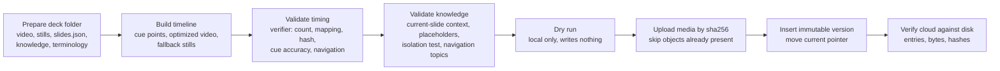
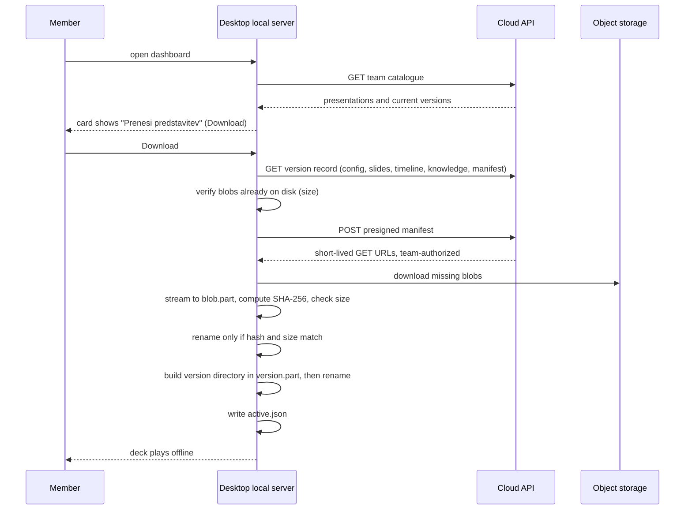
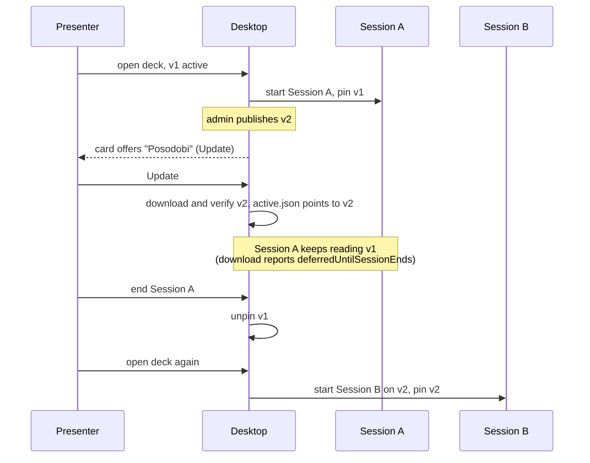
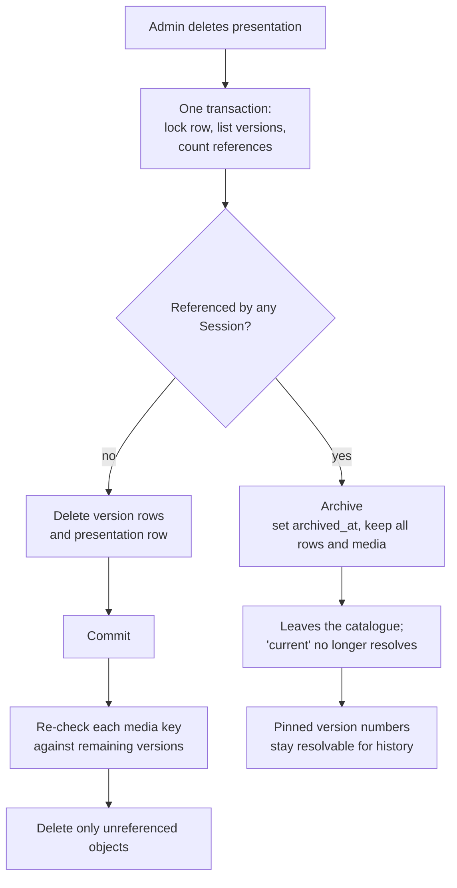

# Presentation versioning and distribution

A published presentation is a sequence of **immutable, content-addressed versions**. Members download a version once, verify it, and play it from local disk. A running meeting is never changed underneath the presenter, and a past meeting always resolves to the deck that was actually shown.

Related: [presentation-engine.md](presentation-engine.md) · [architecture.md](architecture.md) · [security.md](security.md)

## Data model

```text
presentations              one row per deck, team-scoped
  current_version_id  →    what a NEW meeting will use
  archived_at              set when a referenced deck is withdrawn

presentation_versions      immutable; written once, at insert
  version                  1, 2, 3 … per presentation
  config, slides, timeline, knowledge, answers    text content (JSONB)
  manifest                 [{ path, sha256, bytes, contentType, r2Key }]
  slide_count, total_bytes

sessions
  presentation_version_id  what THAT meeting used, forever
```

Text content lives in Postgres, where it is small and queryable. Binary media lives in private object storage under a key derived from its SHA-256. The manifest is the index between the two.

## Publish flow (admin)



- **Publishing is an admin pipeline, not a member API.** It needs direct database and object-storage write credentials. Those exist only in the admin environment, never on member laptops and never behind a route a browser could reach.
- **Idempotent.** A content fingerprint (sorted media hashes plus key-sorted text content, so database JSON key reordering cannot cause a false "changed") is compared with the current version. If equal, nothing is written. If different, the **next** version number is inserted and an existing version row is never modified.
- **Upload before publish.** A version is never inserted pointing at an object that failed to upload.
- **Corrections are new versions.** Fixing a typo in published knowledge creates version N+1. Sessions pinned to version N keep resolving to version N.

## Member flow: catalogue, download, verified cache



### Local cache layout

```text
cache/
  presentations/<id>/<version>/     exact shape of an authored presentation folder
                                    (+ _manifest.json listing the blobs it uses)
  presentations/<id>/active.json    { version, versionId, verifiedAt }
  blobs/<sha256>                    downloaded bytes, shared across versions and decks
```

The version directory has **the same shape as an authored presentation folder**. The presentation loader, knowledge reader and media route do not know versions exist. A single function resolves a presentation id to a directory, and everything downstream is unchanged. Media files are hard-linked from `blobs/` into version directories, with a copy as fallback on filesystems without hard links.

### Integrity rules

| Rule | Mechanism |
|---|---|
| Content-addressed | the SHA-256 is the object identity and the blob filename |
| Deduplicated | a new version that only changes text reuses every existing media blob, and the download is only the new or changed objects |
| Corruption and tamper rejection | every blob is hashed while streaming; a hash or size mismatch deletes the partial file and fails that entry |
| No half-written blob | bytes go to `<sha256>.part` and are renamed only after verification |
| No half-written version | the directory is built as `<version>.part/` and renamed; an existing directory is moved aside first, then removed |
| Never activate incomplete | building a version fails if any manifest blob is missing, and `active.json` is only written for a finished directory |
| Unsafe paths refused | manifest paths and knowledge filenames from the cloud are validated before touching the filesystem |
| Cheap pre-flight | routine checks compare sizes; full re-hashing happens once, at download |
| Resumable at blob granularity | finished blobs are skipped on retry; only the interrupted blob is refetched |

A verified cached version is always playable, whether or not the cloud is reachable.

## Update: v1 → v2 without touching a running meeting



- `active.json` means "the newest verified version, used by the **next** meeting".
- A running Session **pins** the version it started on, in memory. While pinned, every read (video, stills, knowledge, answers) resolves to the pinned version, even if a newer one has been activated.
- The dashboard does not start downloads while a deck is open, and the pin also protects against the local API being called directly.
- Each Session records `presentationVersionId` at creation, and that value is never rewritten.
- Cache garbage collection keeps the two newest versions per deck by default, and never removes the active version or a pinned version. Blobs are removed only when no surviving version's manifest references them.
- Presenter edits to settings and scripted answers are stored beside the immutable version. Settings carry over to v2 as a patch, and edited answers are stored per version.

## Deletion and Session safety

Deletion is **admin-only**. The cloud checks the admin role before any query runs, so a member gets the same refusal for every id and learns nothing about which ids exist. Another team's presentation reads as not found.



- **Archived, not destroyed, when history depends on it.** A hard delete would null out which version a past meeting used. An archived deck disappears from the catalogue and cannot be downloaded or started as a new meeting, but a historical Session's pinned version still resolves by number.
- **Shared media is kept while referenced.** Objects are content-addressed and may be shared across versions and presentations. A key is deleted only if no remaining version references it, checked inside the transaction and again after commit.
- **Database first, storage second.** A failed object delete leaves a harmless orphan, never a row pointing at a missing object. If the re-check itself fails, the objects are kept.

### On member laptops

- At the next catalogue refresh, a downloaded deck the catalogue no longer lists is removed locally, together with the blobs no other downloaded version uses.
- Removal is **deferred** while a Session pins that deck, while an unfinished Session belongs to it, or while a download is in progress.
- An **empty** catalogue response is never trusted to remove anything, so a misconfigured or half-migrated backend cannot wipe every download.
- "Odstrani prenesene predstavitve" (Remove downloaded presentations) in settings clears only downloaded decks and blobs. The login, device identity, Sessions and presenter edits are never touched, and the action is refused while a Session is open or a download is running.
- Recorded Sessions are never deleted as a side effect of presentation removal or app uninstall.
