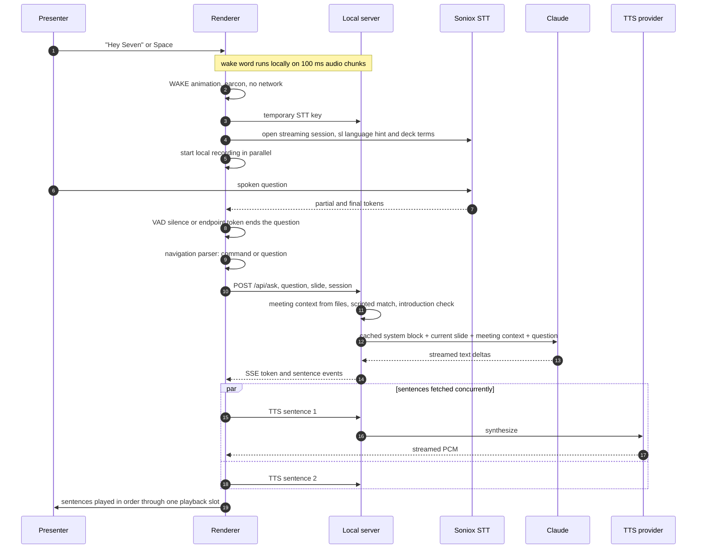

# Realtime voice

This document follows the path from a presenter saying "Hey Seven, what does this cost?" to SevenAI answering aloud in Slovenian, and covers the design decisions that keep that path fast and safe in a live meeting.

Related: [architecture.md](architecture.md) · [knowledge-system.md](knowledge-system.md) · [meeting-memory.md](meeting-memory.md)

## The loop

```text
IDLE ── Space / "Hey Seven" ─▶ WAKE ─▶ LISTENING ─▶ THINKING ─▶ SPEAKING ─▶ IDLE
  ▲                                                                          │
  └──────────────────────────────── Esc ─────────────────────────────────────┘
```

A small state machine declares which transitions are legal. An unexpected transition is logged, not thrown, because a state bug must not stop a presentation.

## Sequence



## Activation

- **Wake word.** "Hey Seven" is detected by a sherpa-onnx keyword-spotting transducer running inside the local server process. It is a native addon, so the renderer captures 16 kHz mono audio and posts 100 ms chunks over loopback. Chunks are never dropped: the phrase spans several chunks, and a hole in the middle destroys detection. If the local server is busy, chunks are queued and sent together.
- **Space** (or a click on the assistant) calls the same `activate()` function, so the two paths cannot behave differently.
- The keyword phrase is English and the question is Slovenian. The two do not need to match.
- While IDLE, nothing is sent to a speech provider. Streaming STT exists only for the duration of one question.

## Listening and endpointing

One listening session per question, with two engines behind one interface:

| Engine | Role |
|---|---|
| Soniox realtime WebSocket | Primary. Streaming partials and endpoint detection, Slovenian language hint, vocabulary boosting from global and deck terminology. |
| Local recording + batch transcription | Always recorded in parallel. It is transcribed (OpenAI) only when the stream produced nothing usable, so a slow WebSocket handshake never loses the start of a question. |

**Voice-activity detection** runs on RMS levels from the microphone analyser for both engines, with separate start and stop thresholds that can be calibrated per room.

**Adaptive endpointing.** A fixed silence window charges every question the same delay. SevenAI uses a short base window (700 ms) only when the transcript so far looks like a finished sentence. When the last word is a Slovenian conjunction, preposition or bare question word ("in", "za", "kako"), or fewer than two words have been heard, a longer window (1300 ms) applies. The check is one set lookup per animation frame: no model, no network.

**Final-word handling.** The end of the question is often decided (by silence or by the endpoint token) before the provider has delivered final tokens for the last words spoken. The session then waits a bounded time, capped at 450 ms, for those finals, and leaves immediately if nothing is pending. A late word is worth a short wait; a lost word is not worth a noticeable pause.

**Hard limits.** A question is capped at 12 s, and a session where nobody speaks returns quietly to IDLE after 6 s.

## Deterministic navigation versus questions

Before a question reaches the server, a deterministic parser decides whether it is an instruction to move the deck:

| Outcome | Example (Slovenian) | Result |
|---|---|---|
| explicit slide | "pojdi na peti slajd" | jump to slide 5 |
| relative | "pokaži naslednjo stran", "nazaj" | next / previous |
| topic | "pokaži program zvestobe" | resolved against the deck's own titles and keywords |
| none | "kako bi to izvedli?" | treated as a question |

The bar for navigating is deliberately high. A sentence must open with a navigation verb, and anything that opens like a question never navigates. Ordinals are parsed by stem so every grammatical case matches, and "stranka" (client) is explicitly excluded from "stran" (page). Topic matches must clear a confidence threshold, using prefix matching to cope with Slovenian inflection.

Navigation never depends on a model. A model asked for a slide number will occasionally invent one, and a deck jumping to the wrong slide in front of a client is not an acceptable failure. Parsing locally also makes navigation take milliseconds instead of seconds.

## Answer generation

The server runs a fixed order for every question:

1. **Meeting context** (if a Session is recording): rolling memory and recent conversation, read from files. See [meeting-memory.md](meeting-memory.md).
2. **Scripted answer.** A strict matcher (minimum score and minimum question coverage) over the presenter's scripted Q&A. A match is spoken word for word. This step is skipped for questions about the meeting itself.
3. **Introduction.** "Predstavi se" / "Kdo si?" without a scripted entry uses the deterministic introduction, never the model.
4. **Model stream.** Claude, with thinking disabled, a prompt-cached system block and a per-question word budget. See [knowledge-system.md](knowledge-system.md).
5. **First-token timeout.** If no token arrives in time, the stream is aborted and a prepared answer is used.

The server emits a `sentence` SSE event the moment a sentence is complete. The browser starts synthesising sentence 1 while the model is still writing sentence 2. Sentence-level chunking is the single largest perceived-latency win in the pipeline.

**Spoken Slovenian.** The prompt requires natural Slovenian regardless of the question's language, keeps brand names and established English terms untranslated, forbids markdown, lists and emoji (the text will be read aloud), and asks for a short first sentence of at most eight words so audio starts sooner. Answer length is given as a **word budget** derived from a target duration and a measured words-per-second rate, because models hold word counts well and ignore durations. The budget is repeated in the uncached user turn, where it holds better than a rule far up the system prompt.

## Speech output

- TTS responses are streamed as raw PCM, so playback starts before a sentence finishes downloading. A short pre-roll avoids a stuttering first word.
- Sentences are fetched concurrently and played strictly in order through **one playback slot** (see [architecture.md](architecture.md#one-voice-playback)).
- The provider and voice of the first sentence are pinned for the whole answer.
- The assistant's mouth follows the real waveform amplitude.

## Barge-in

Activation is accepted not only from IDLE but also from THINKING and SPEAKING. Interrupting is a supported gesture:

- The old interaction is cancelled completely: the LLM stream is aborted, queued audio is dropped, and late events are checked against their own interaction id so they cannot revive the old answer.
- The microphone gate the answer had closed is reopened immediately, not after its usual tail, so the first words of the interruption are not lost.
- While SevenAI speaks, the wake word listens in a stricter barge-in mode.
- Esc always cancels, with a short audio fade so the cut does not click.

## Keeping the assistant's voice out of the transcript

SevenAI answers through the laptop speakers, and the microphone hears them. There are three layers of defence:

1. **Browser audio processing:** echo cancellation, noise suppression and auto gain on the microphone stream.
2. **The gate:** while TTS plays, and for a 450 ms reverb tail afterwards, question-path tokens and VAD samples are ignored.
3. **The assistant-echo filter** for the meeting transcript. A blunt "drop everything while he speaks" would delete the people who talk over him, and those are often the most important lines of a meeting. Because the exact text SevenAI spoke is known from its own interaction log, a transcript segment overlapping an answer window is dropped only when its words are covered by the answer text (asymmetric word-bag coverage of at least 0.7, or at least 0.95 for fragments of four words or fewer). Anything else is kept and flagged `duringAssistantSpeech: true`.

Structurally, the assistant is never a speaker in the transcript. Its utterances live in a separate interactions log, and every meeting prompt labels them as the assistant's words and states they are not client statements.
