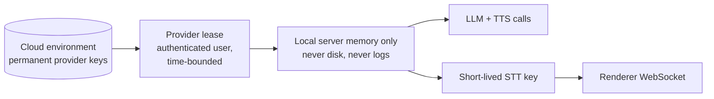

# Security model

This describes SevenAI's security architecture. It covers design, not operational detail: no production endpoints, credentials or configuration values that would help an attacker. To report a concern, see [SECURITY.md](../SECURITY.md).

Related: [architecture.md](architecture.md) · [desktop.md](desktop.md) · [presentation-versioning.md](presentation-versioning.md)

## Threats taken seriously

- An installer or unpacked app bundle inspected by anyone who has a copy.
- A lost or stolen presenter laptop.
- A member account trying to reach another team's data or perform admin actions.
- A leaked public (anon) database key.
- Web content in the app window navigating somewhere it should not, or reaching Node.
- The assistant's own voice or a model's inference being recorded as a client statement.

Out of scope: an attacker who already controls the operating system account the app runs under. No desktop application can defend against that.

## Credentials: nothing permanent ships

- **No provider keys in the desktop app.** A packaged build strips provider keys, database URLs, service-role secrets and storage credentials from the local server's environment, and never reads a `.env` file.
- **Provider leases.** After login, the cloud lends provider credentials to the authenticated laptop for a bounded period with a hard maximum. The lease is held in process memory and renewed before expiry. It is never written to disk, never logged, and never returned by any status endpoint. Status reports only whether a provider is leased, plus a short non-reversible fingerprint to tell two credentials apart.
- **Edge keys are separate** from cloud-side keys, so edge credentials can be rotated centrally without disturbing anything else. The lease mapping is an explicit allow-list, and cloud-only credentials are never read by the lease code.
- **The browser never holds a permanent key.** Streaming STT uses a temporary key minted for that purpose with a short expiry.
- **Stated trade-off.** A leased key is a real key in the memory of a laptop. Leasing binds it to a named, disableable user, keeps it out of every installer and repository, and limits its lifetime. A lost laptop is handled centrally: disable the user and rotate the edge credentials.
- **Graceful on failure.** A failed renewal keeps the current credentials and retries, so a network blip cannot silence the assistant mid-meeting.

## Persisted sign-in

- The refresh token is stored encrypted with **AES-256-GCM**.
- The data key is a random 32-byte key sealed with **Electron `safeStorage`**: DPAPI on Windows, a Keychain-held key on macOS. Only the main process can unseal it, and it hands the key to the local server at startup.
- The sealed files cannot be opened under another OS account or on another machine. If the key cannot be unsealed, the result is a logged-out state and a new login. Presentations and Sessions do not depend on this key.
- Logging out erases the stored token.

## Electron hardening

| Control | Setting |
|---|---|
| Renderer isolation | `contextIsolation: true`, `sandbox: true`, `nodeIntegration: false` |
| Preload surface | read-only facts only (desktop flag, version, platform); no filesystem, shell or IPC functions |
| Navigation | in-window navigation limited to the app's own origin; other http(s) links open in the system browser; other schemes are blocked and logged |
| New windows | denied unless same-origin |
| `<webview>` | attachment prevented |
| Permissions | only microphone (audio only, no camera), fullscreen and sanitized clipboard write, and only for the app's own origin |
| Electron fuses | run-as-Node off, `NODE_OPTIONS` ignored, `--inspect` arguments ignored, app loaded only from its asar archive, cookie encryption on |
| Debugging | packaged builds refuse to start with remote-debugging or inspector switches and disable DevTools, unless an explicit opt-in used only by the packaged-app test harness is set in the local environment |
| Menus | no reload or DevTools shortcuts in packaged builds |
| Single instance | a second launch focuses the existing window instead of starting another server and microphone pipeline |
| macOS | hardened runtime; microphone access declared with a usage description |

## Local server

- Binds to **127.0.0.1 only**. It is not reachable from the network.
- Runs in an Electron utility process, not in the renderer.
- Validates every id that becomes a filesystem path (presentation ids, session ids, version numbers, manifest paths, knowledge filenames) before touching disk.
- Accepts only appends to meeting streams. Session metadata changes pass through an explicit allow-list.

## Build pipeline

- CI desktop builds need no production secrets. The only secrets a build may read are optional code-signing credentials.
- Every build output is **scanned before upload**. The scan reads inside the app archive and fails the build on any known secret value, any secret-shaped string (provider key prefixes, database URLs with passwords, service-role tokens, private key blocks), any data files (`.env`, auth or device files, Sessions, cache, presentation media, certificates), or a missing required file. Secret values are compared in memory and never printed.
- Third-party model files downloaded at build time are checked against pinned SHA-256 hashes.

## Cloud authorization

- **Identity.** Supabase Auth issues the tokens. The cloud API verifies them locally against the project's published asymmetric signing keys, checking signature, expiry, issuer and audience. The API holds nothing that can mint a token.
- **Roles.** `admin` and `member`, stored on the user's profile and checked in one middleware. Disabled profiles are refused.
- **Team scoping.** Every presentation and Session query is filtered by the caller's team **in the same statement** that looks up the row. A row belonging to another team returns not found rather than forbidden, so a request cannot confirm that a guessed id exists.
- **Row-level security.** Enabled and forced on every application table with **no permissive policies**. The API connects with a service role and performs authorization itself. RLS is an independent backstop: a leaked anon key can read and write nothing.
- **Private object storage.** No public bucket URL exists. Downloads use short-lived presigned URLs, minted per request after team authorization. The route that mints them is a POST, so the credentials stay out of URLs, access logs and caches.
- **Single writer for Sessions.** Only the device that recorded a Session may append to it.
- **Validation.** Request input is validated by hand-written validators that reject malformed ids and shapes before they reach SQL.

| Capability | member | admin |
|---|---|---|
| Sign in, download team presentations, present | ✓ | ✓ |
| Record Sessions and sync them | ✓ | ✓ |
| Delete or archive a presentation | | ✓ |
| Publish a presentation version | | admin pipeline only |

## Destructive operations

- Presentation deletion is admin-only and runs inside a transaction. A deck referenced by any Session is **archived**, not deleted. Media objects are removed only after commit and only when no remaining version references them. See [presentation-versioning.md](presentation-versioning.md#deletion-and-session-safety).
- Local cleanup is refused or deferred while a meeting is using the deck.
- Deleting a Session is an explicit, confirmed action in the Sessions view. Uninstalling the app does not delete Sessions.

## Privacy in meetings

- Recording is opt-in per presentation open and always visibly indicated.
- By default, raw meeting audio is deleted after the transcript is verified and the summary is produced. It is uploaded to the cloud only if the Session's retention is explicitly set to keep it.
- The assistant's words are stored separately from participants' words and are filtered out of the transcript.
- Summaries separate transcript-supported facts from AI suggestions, and never guess who owns a task.

## Diagnostics

Presentation mode shows no diagnostics. The diagnostics HUD and calibration panel exist only when the app is opened with `?dev=1`. Logs record provider state, fallbacks and failure reasons, and never credentials.
